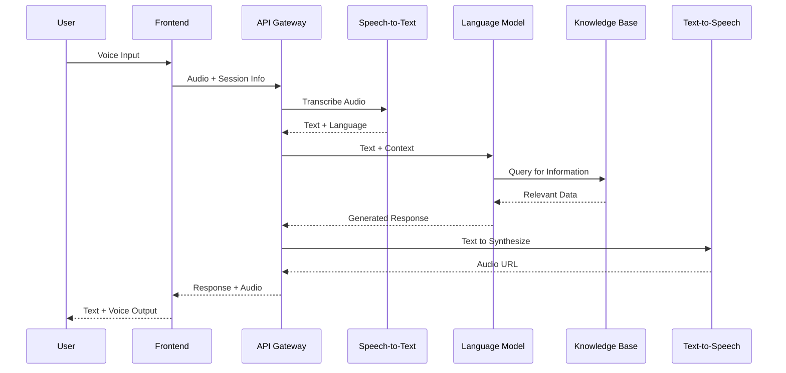

# Saarthi AI – System Design Document

## 1. Executive Summary

Saarthi AI is a cloud-native, voice-first multilingual AI assistant designed to democratize access to public services in India. The system leverages modern AI technologies including speech processing, large language models, and retrieval-augmented generation to provide contextual, step-by-step guidance in users' preferred languages.

**Core Design Philosophy:**
- Voice-first interaction with text fallback
- Multilingual support with automatic language detection
- Context-aware conversational intelligence
- Scalable, serverless architecture
- Privacy-by-design approach

---

## 2. System Architecture Overview

### 2.1 High-Level Architecture

```
┌─────────────────┐    ┌──────────────────┐    ┌─────────────────┐
│   User Device   │    │   Frontend App   │    │  Backend APIs   │
│  (Voice/Touch)  │◄──►│ (Web/Mobile UI)  │◄──►│   (Serverless)  │
└─────────────────┘    └──────────────────┘    └─────────────────┘
                                                         │
                       ┌─────────────────────────────────┼─────────────────────────────────┐
                       │                                 │                                 │
                       ▼                                 ▼                                 ▼
            ┌──────────────────┐              ┌──────────────────┐              ┌──────────────────┐
            │ Speech Processing│              │   AI/ML Layer    │              │ Knowledge Layer  │
            │   (STT/TTS)      │              │ (LLM + Intent)   │              │ (RAG + Datasets) │
            └──────────────────┘              └──────────────────┘              └──────────────────┘
```

### 2.2 Technology Stack

**Frontend:**
- React.js with TypeScript for web application
- React Native for mobile applications
- Progressive Web App (PWA) capabilities
- Responsive design with accessibility features

**Backend:**
- AWS Lambda for serverless compute
- API Gateway for request routing and rate limiting
- Amazon Bedrock for LLM services
- Amazon Transcribe for speech-to-text
- Amazon Polly for text-to-speech

**Data & Storage:**
- Amazon DynamoDB for user sessions and preferences
- Amazon S3 for static knowledge datasets
- Amazon OpenSearch for vector search capabilities
- Redis for caching frequently accessed data

**Infrastructure:**
- AWS CloudFormation for infrastructure as code
- Amazon CloudFront for global content delivery
- AWS WAF for security and DDoS protection
- Amazon CloudWatch for monitoring and logging

---

## 3. Detailed Component Design

### 3.1 Frontend Application Layer

#### 3.1.1 User Interface Components

**Voice Interaction Interface:**
```typescript
interface VoiceInterface {
  microphoneButton: MicrophoneButton;
  audioVisualizer: AudioWaveform;
  languageSelector: LanguageDropdown;
  conversationHistory: MessageList;
  quickActions: ActionButtons[];
}
```

**Key Features:**
- Large, accessible microphone button with visual feedback
- Real-time audio visualization during recording
- Language selection with flag icons and native names
- Chat-style conversation history with voice playback
- Quick action buttons for common queries

**Accessibility Features:**
- High contrast mode support
- Screen reader compatibility
- Voice navigation commands
- Large touch targets (minimum 44px)
- Keyboard navigation support

#### 3.1.2 State Management

```typescript
interface AppState {
  user: {
    preferredLanguage: string;
    location?: GeoLocation;
    sessionId: string;
  };
  conversation: {
    messages: Message[];
    isListening: boolean;
    isProcessing: boolean;
    currentContext: ConversationContext;
  };
  settings: {
    voiceEnabled: boolean;
    textSize: 'small' | 'medium' | 'large';
    highContrast: boolean;
  };
}
```

### 3.2 Speech Processing Layer

#### 3.2.1 Speech-to-Text Service

**Implementation:**
```typescript
class SpeechToTextService {
  private transcribeClient: AWS.TranscribeService;
  
  async transcribeAudio(
    audioBlob: Blob, 
    languageCode: string
  ): Promise<TranscriptionResult> {
    // Real-time streaming transcription
    // Language-specific model selection
    // Noise reduction and audio enhancement
  }
  
  async detectLanguage(audioBlob: Blob): Promise<string> {
    // Automatic language identification
    // Support for code-mixing detection
  }
}
```

**Supported Languages:**
- Hindi (hi-IN)
- English (en-IN)
- Bengali (bn-IN)
- Tamil (ta-IN)
- Telugu (te-IN)
- Marathi (mr-IN)
- Gujarati (gu-IN)

**Audio Processing Features:**
- Noise cancellation for urban environments
- Automatic gain control for varying volumes
- Support for different audio formats (WebM, MP3, WAV)
- Real-time streaming for faster response times

#### 3.2.2 Text-to-Speech Service

**Implementation:**
```typescript
class TextToSpeechService {
  private pollyClient: AWS.Polly;
  
  async synthesizeSpeech(
    text: string,
    languageCode: string,
    voiceId: string
  ): Promise<AudioBuffer> {
    // Neural voice synthesis
    // SSML markup for natural speech
    // Emotion and tone adjustment
  }
  
  getOptimalVoice(language: string, gender?: string): string {
    // Select most natural voice for language
    // Consider regional accents and dialects
  }
}
```

**Voice Characteristics:**
- Natural, conversational tone
- Appropriate speaking pace (150-160 WPM)
- Clear pronunciation of technical terms
- Regional accent support where available

### 3.3 Language Understanding & Intent Processing

#### 3.3.1 LLM Integration Architecture

**Core LLM Service:**
```typescript
class LanguageUnderstandingService {
  private bedrockClient: AWS.Bedrock;
  
  async processQuery(
    userInput: string,
    context: ConversationContext,
    language: string
  ): Promise<IntentResult> {
    const prompt = this.buildPrompt(userInput, context, language);
    const response = await this.bedrockClient.invokeModel({
      modelId: 'anthropic.claude-3-sonnet-20240229-v1:0',
      body: JSON.stringify({
        messages: [{ role: 'user', content: prompt }],
        max_tokens: 1000,
        temperature: 0.3
      })
    });
    
    return this.parseIntentResponse(response);
  }
}
```

**Intent Classification:**
```typescript
enum IntentType {
  TRANSPORT_NAVIGATION = 'transport_navigation',
  SCHEME_DISCOVERY = 'scheme_discovery',
  SCHEME_APPLICATION = 'scheme_application',
  GENERAL_HELP = 'general_help',
  CLARIFICATION = 'clarification',
  GREETING = 'greeting'
}

interface IntentResult {
  intent: IntentType;
  confidence: number;
  entities: ExtractedEntity[];
  followUpQuestions?: string[];
  requiresAdditionalInfo: boolean;
}
```

#### 3.3.2 Entity Extraction

**Location Entities:**
```typescript
interface LocationEntity {
  type: 'source' | 'destination' | 'landmark';
  value: string;
  coordinates?: [number, number];
  confidence: number;
  alternatives?: string[];
}
```

**User Profile Entities:**
```typescript
interface UserProfileEntity {
  age?: number;
  income?: IncomeRange;
  occupation?: string;
  location?: string;
  familySize?: number;
  category?: 'general' | 'obc' | 'sc' | 'st';
}
```

#### 3.3.3 Conversation Context Management

```typescript
class ConversationContextManager {
  private contexts: Map<string, ConversationContext> = new Map();
  
  updateContext(
    sessionId: string, 
    newInfo: Partial<ConversationContext>
  ): void {
    const existing = this.contexts.get(sessionId) || {};
    this.contexts.set(sessionId, { ...existing, ...newInfo });
  }
  
  getContext(sessionId: string): ConversationContext {
    return this.contexts.get(sessionId) || this.createDefaultContext();
  }
}

interface ConversationContext {
  currentIntent?: IntentType;
  userProfile: UserProfileEntity;
  locationContext?: LocationEntity[];
  previousQueries: string[];
  pendingInformation: string[];
  conversationStage: 'greeting' | 'information_gathering' | 'processing' | 'response_delivery';
}
```

### 3.4 Knowledge Retrieval Layer

#### 3.4.1 Retrieval-Augmented Generation (RAG) System

**Vector Database Implementation:**
```typescript
class KnowledgeRetrievalService {
  private openSearchClient: AWS.OpenSearch;
  private embeddingService: EmbeddingService;
  
  async retrieveRelevantInfo(
    query: string,
    intent: IntentType,
    context: ConversationContext
  ): Promise<RetrievedKnowledge[]> {
    const queryEmbedding = await this.embeddingService.embed(query);
    
    const searchResults = await this.openSearchClient.search({
      index: this.getIndexForIntent(intent),
      body: {
        query: {
          knn: {
            embedding_vector: {
              vector: queryEmbedding,
              k: 10
            }
          }
        },
        _source: ['content', 'metadata', 'source']
      }
    });
    
    return this.processSearchResults(searchResults, context);
  }
}
```

#### 3.4.2 Knowledge Base Structure

**Transport Knowledge Base:**
```json
{
  "routes": [
    {
      "id": "route_001",
      "source": "Connaught Place",
      "destination": "AIIMS",
      "options": [
        {
          "mode": "metro",
          "steps": [
            "Walk to Rajiv Chowk Metro Station (2 minutes)",
            "Take Yellow Line towards HUDA City Centre",
            "Get down at AIIMS Metro Station (4 stops, 8 minutes)",
            "Exit from Gate 2 and walk to AIIMS main entrance (3 minutes)"
          ],
          "cost": "₹20-30",
          "duration": "15-20 minutes",
          "accessibility": "wheelchair_accessible"
        }
      ]
    }
  ]
}
```

**Government Schemes Knowledge Base:**
```json
{
  "schemes": [
    {
      "id": "pmay_urban",
      "name": "Pradhan Mantri Awas Yojana (Urban)",
      "description": "Housing scheme for urban poor",
      "eligibility": {
        "income": "< ₹18,00,000 annually",
        "age": "> 18 years",
        "location": "urban_areas",
        "housing_status": "homeless_or_inadequate"
      },
      "benefits": [
        "Interest subsidy on home loans",
        "Direct financial assistance up to ₹2.5 lakh"
      ],
      "application_process": [
        "Visit nearest Common Service Centre (CSC)",
        "Fill application form with required documents",
        "Submit Aadhaar, income certificate, and bank details",
        "Wait for verification and approval (30-45 days)"
      ],
      "required_documents": [
        "Aadhaar Card",
        "Income Certificate",
        "Bank Account Details",
        "Passport Size Photos"
      ]
    }
  ]
}
```

#### 3.4.3 Dynamic Knowledge Updates

```typescript
class KnowledgeUpdateService {
  async updateTransportData(): Promise<void> {
    // Fetch latest route information from transport APIs
    // Update vector embeddings for new routes
    // Invalidate cached responses for affected queries
  }
  
  async updateSchemeData(): Promise<void> {
    // Scrape government websites for scheme updates
    // Validate information accuracy
    // Update knowledge base with new schemes or changes
  }
  
  async validateInformation(source: string): Promise<boolean> {
    // Cross-reference with official sources
    // Check for information freshness
    // Flag outdated or potentially incorrect data
  }
}
```

### 3.5 Response Generation & Orchestration

#### 3.5.1 Response Generation Service

```typescript
class ResponseGenerationService {
  async generateResponse(
    intent: IntentResult,
    retrievedKnowledge: RetrievedKnowledge[],
    context: ConversationContext,
    language: string
  ): Promise<GeneratedResponse> {
    const prompt = this.buildResponsePrompt({
      intent,
      knowledge: retrievedKnowledge,
      context,
      language,
      responseGuidelines: this.getLanguageSpecificGuidelines(language)
    });
    
    const llmResponse = await this.llmService.generate(prompt);
    
    return {
      text: llmResponse.text,
      audioUrl: await this.ttsService.synthesize(llmResponse.text, language),
      followUpSuggestions: llmResponse.followUpSuggestions,
      actionItems: this.extractActionItems(llmResponse.text)
    };
  }
  
  private getLanguageSpecificGuidelines(language: string): ResponseGuidelines {
    return {
      maxSentenceLength: language === 'hi' ? 15 : 12,
      useSimpleWords: true,
      includeTransliterations: language !== 'en',
      culturalContext: this.getCulturalContext(language)
    };
  }
}
```

#### 3.5.2 Response Quality Assurance

```typescript
class ResponseQualityService {
  async validateResponse(
    response: GeneratedResponse,
    originalQuery: string,
    language: string
  ): Promise<QualityScore> {
    const checks = await Promise.all([
      this.checkFactualAccuracy(response.text),
      this.checkLanguageAppropriate(response.text, language),
      this.checkActionability(response.text),
      this.checkClarity(response.text, language)
    ]);
    
    return this.calculateOverallScore(checks);
  }
  
  private async checkFactualAccuracy(text: string): Promise<number> {
    // Verify facts against knowledge base
    // Check for consistency with official sources
    // Flag potential misinformation
  }
}
```

---

## 4. Data Flow Architecture

### 4.1 Complete Request-Response Flow



### 4.2 Error Handling Flow

```typescript
class ErrorHandlingService {
  async handleError(
    error: ServiceError,
    context: ConversationContext,
    language: string
  ): Promise<ErrorResponse> {
    switch (error.type) {
      case 'SPEECH_RECOGNITION_FAILED':
        return this.generateFallbackResponse(
          "I couldn't understand your voice clearly. Could you please try again or type your question?",
          language
        );
      
      case 'KNOWLEDGE_RETRIEVAL_FAILED':
        return this.generateFallbackResponse(
          "I'm having trouble finding that information right now. Let me try to help you with something else.",
          language
        );
      
      case 'LLM_SERVICE_UNAVAILABLE':
        return this.generateStaticResponse(context, language);
      
      default:
        return this.generateGenericErrorResponse(language);
    }
  }
}
```

---

## 5. Scalability & Performance Design

### 5.1 Auto-Scaling Architecture

**Lambda Function Configuration:**
```yaml
Functions:
  SpeechProcessing:
    ReservedConcurrency: 100
    ProvisionedConcurrency: 10
    Timeout: 30s
    Memory: 1024MB
  
  LanguageUnderstanding:
    ReservedConcurrency: 200
    ProvisionedConcurrency: 20
    Timeout: 60s
    Memory: 2048MB
  
  ResponseGeneration:
    ReservedConcurrency: 150
    ProvisionedConcurrency: 15
    Timeout: 45s
    Memory: 1536MB
```

**Caching Strategy:**
```typescript
class CachingService {
  private redis: Redis;
  
  async cacheResponse(
    queryHash: string,
    response: GeneratedResponse,
    ttl: number = 3600
  ): Promise<void> {
    await this.redis.setex(
      `response:${queryHash}`,
      ttl,
      JSON.stringify(response)
    );
  }
  
  async getCachedResponse(queryHash: string): Promise<GeneratedResponse | null> {
    const cached = await this.redis.get(`response:${queryHash}`);
    return cached ? JSON.parse(cached) : null;
  }
}
```

### 5.2 Performance Optimization

**Response Time Targets:**
- Speech-to-Text: < 2 seconds
- Intent Understanding: < 1 second
- Knowledge Retrieval: < 1 second
- Response Generation: < 2 seconds
- Text-to-Speech: < 1.5 seconds
- **Total End-to-End: < 7.5 seconds**

**Optimization Strategies:**
- Parallel processing of independent operations
- Streaming responses for long-form content
- Predictive caching of common queries
- CDN distribution of audio responses
- Connection pooling for database operations

---

## 6. Security & Privacy Architecture

### 6.1 Data Protection Framework

```typescript
class PrivacyService {
  async anonymizeUserData(userData: UserData): Promise<AnonymizedData> {
    return {
      sessionId: this.generateSessionHash(userData.deviceId),
      location: this.generalizeLocation(userData.location),
      demographics: this.generalizeProfile(userData.profile),
      timestamp: userData.timestamp
    };
  }
  
  async encryptSensitiveData(data: string): Promise<string> {
    return await this.kmsService.encrypt(data, this.getEncryptionKey());
  }
}
```

**Security Measures:**
- End-to-end encryption for voice data
- Zero-knowledge architecture for personal information
- Automatic data purging after session completion
- Rate limiting and DDoS protection
- Input validation and sanitization
- Secure API authentication using JWT tokens

### 6.2 Compliance Framework

**Data Retention Policy:**
- Voice recordings: Deleted immediately after transcription
- Session data: Retained for 24 hours for context
- Analytics data: Anonymized and aggregated only
- User preferences: Stored locally on device when possible

**Audit Logging:**
```typescript
interface AuditLog {
  timestamp: string;
  sessionId: string;
  action: string;
  dataAccessed: string[];
  userConsent: boolean;
  retentionPeriod: number;
}
```

---

## 7. Monitoring & Observability

### 7.1 Application Monitoring

**Key Metrics:**
```typescript
interface SystemMetrics {
  responseTime: {
    p50: number;
    p95: number;
    p99: number;
  };
  accuracy: {
    speechRecognition: number;
    intentClassification: number;
    responseRelevance: number;
  };
  availability: {
    uptime: number;
    errorRate: number;
  };
  usage: {
    activeUsers: number;
    queriesPerSecond: number;
    languageDistribution: Record<string, number>;
  };
}
```

**Alerting Configuration:**
- Response time > 10 seconds: Critical alert
- Error rate > 5%: Warning alert
- Speech recognition accuracy < 90%: Investigation alert
- Service unavailability: Immediate escalation

### 7.2 User Experience Monitoring

```typescript
class UXMonitoringService {
  async trackUserJourney(
    sessionId: string,
    events: UserEvent[]
  ): Promise<void> {
    const journey = this.analyzeUserFlow(events);
    await this.logUserExperience({
      sessionId,
      completionRate: journey.completionRate,
      satisfactionScore: journey.satisfactionScore,
      dropOffPoints: journey.dropOffPoints,
      timeToResolution: journey.timeToResolution
    });
  }
}
```

---

## 8. Deployment & DevOps Strategy

### 8.1 Infrastructure as Code

**CloudFormation Template Structure:**
```yaml
Resources:
  # API Gateway
  SaarthiAPI:
    Type: AWS::ApiGateway::RestApi
    Properties:
      Name: saarthi-ai-api
      EndpointConfiguration:
        Types: [REGIONAL]
  
  # Lambda Functions
  SpeechProcessingFunction:
    Type: AWS::Lambda::Function
    Properties:
      Runtime: nodejs18.x
      Handler: speech.handler
      Environment:
        Variables:
          TRANSCRIBE_REGION: !Ref AWS::Region
  
  # DynamoDB Tables
  UserSessionsTable:
    Type: AWS::DynamoDB::Table
    Properties:
      BillingMode: PAY_PER_REQUEST
      AttributeDefinitions:
        - AttributeName: sessionId
          AttributeType: S
```

### 8.2 CI/CD Pipeline

**Deployment Stages:**
1. **Development**: Feature branches with automated testing
2. **Staging**: Integration testing with mock data
3. **Production**: Blue-green deployment with rollback capability

**Quality Gates:**
- Unit test coverage > 80%
- Integration test pass rate > 95%
- Performance benchmarks met
- Security scan passed
- Accessibility compliance verified

---

## 9. Testing Strategy

### 9.1 Automated Testing Framework

**Unit Tests:**
```typescript
describe('LanguageUnderstandingService', () => {
  test('should correctly identify transport intent in Hindi', async () => {
    const service = new LanguageUnderstandingService();
    const result = await service.processQuery(
      "मुझे कनॉट प्लेस से एम्स जाना है",
      mockContext,
      'hi'
    );
    
    expect(result.intent).toBe(IntentType.TRANSPORT_NAVIGATION);
    expect(result.confidence).toBeGreaterThan(0.8);
  });
});
```

**Integration Tests:**
```typescript
describe('End-to-End Voice Query', () => {
  test('should handle complete voice-to-response flow', async () => {
    const audioFile = loadTestAudio('hindi_transport_query.wav');
    const response = await request(app)
      .post('/api/voice-query')
      .attach('audio', audioFile)
      .expect(200);
    
    expect(response.body.text).toContain('steps');
    expect(response.body.audioUrl).toBeDefined();
  });
});
```

### 9.2 Property-Based Testing

**Correctness Properties:**

**Property 1: Response Language Consistency**
```typescript
// **Validates: Requirements 4.1.2, 4.2.1**
property('response language matches input language', 
  fc.record({
    query: fc.string(),
    language: fc.constantFrom('hi', 'en', 'bn', 'ta')
  }),
  async ({ query, language }) => {
    const response = await languageService.processQuery(query, mockContext, language);
    const detectedLanguage = await languageDetector.detect(response.text);
    return detectedLanguage === language;
  }
);
```

**Property 2: Response Actionability**
```typescript
// **Validates: Requirements 4.3.3, 4.4.5**
property('transport responses contain actionable steps',
  fc.record({
    source: fc.string(),
    destination: fc.string(),
    language: fc.constantFrom('hi', 'en')
  }),
  async ({ source, destination, language }) => {
    const query = `How to go from ${source} to ${destination}`;
    const response = await transportService.getDirections(query, language);
    
    return response.steps.length > 0 && 
           response.steps.every(step => step.includes('action_verb'));
  }
);
```

**Property 3: Privacy Preservation**
```typescript
// **Validates: Requirements NFR-3.1, NFR-3.2**
property('no sensitive data in logs',
  fc.record({
    userInput: fc.string(),
    personalInfo: fc.record({
      phone: fc.string(),
      address: fc.string(),
      income: fc.integer()
    })
  }),
  async ({ userInput, personalInfo }) => {
    await processUserQuery(userInput, personalInfo);
    const logs = await getSystemLogs();
    
    return !logs.some(log => 
      log.includes(personalInfo.phone) ||
      log.includes(personalInfo.address) ||
      log.includes(personalInfo.income.toString())
    );
  }
);
```

---

## 10. Future Architecture Considerations

### 10.1 Offline Capability

**Progressive Web App Features:**
- Service worker for offline functionality
- Local storage of essential knowledge
- Queue-based sync when connection restored

**Offline Knowledge Base:**
```typescript
class OfflineKnowledgeService {
  private localDB: IndexedDB;
  
  async syncEssentialData(): Promise<void> {
    const essentialRoutes = await this.fetchCriticalRoutes();
    const essentialSchemes = await this.fetchPopularSchemes();
    
    await this.localDB.store('routes', essentialRoutes);
    await this.localDB.store('schemes', essentialSchemes);
  }
}
```

### 10.2 Multi-Modal Integration

**WhatsApp Bot Integration:**
```typescript
class WhatsAppBotService {
  async handleIncomingMessage(
    phoneNumber: string,
    message: string
  ): Promise<void> {
    const response = await this.processQuery(message, 'hi');
    await this.sendWhatsAppMessage(phoneNumber, response.text);
    
    if (response.audioUrl) {
      await this.sendWhatsAppAudio(phoneNumber, response.audioUrl);
    }
  }
}
```

### 10.3 Advanced AI Features

**Predictive Assistance:**
```typescript
class PredictiveService {
  async predictUserNeeds(
    userHistory: UserInteraction[],
    currentContext: ConversationContext
  ): Promise<PredictedNeed[]> {
    // Analyze patterns in user behavior
    // Predict likely next queries
    // Proactively cache relevant information
  }
}
```

---

## 11. Success Metrics & KPIs

### 11.1 Technical Performance Metrics

**Response Time Distribution:**
- Target: 90% of queries < 3 seconds
- Measurement: End-to-end latency tracking
- Alerting: P95 > 5 seconds

**Accuracy Metrics:**
- Speech Recognition: >95% word accuracy
- Intent Classification: >90% correct classification
- Response Relevance: >85% user satisfaction

### 11.2 User Experience Metrics

**Task Completion Rate:**
- Target: >85% successful task completion
- Measurement: User journey analytics
- Segmentation: By language, user type, query complexity

**User Satisfaction:**
- Target: >4.2/5 average rating
- Measurement: Post-interaction surveys
- Tracking: Sentiment analysis of user feedback

---

This comprehensive design document provides a robust technical foundation for implementing Saarthi AI, ensuring scalability, maintainability, and user-centric design while meeting all functional and non-functional requirements outlined in the requirements document.